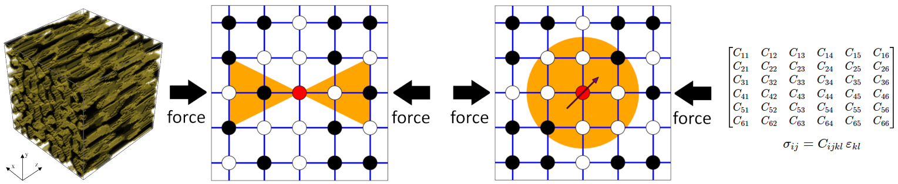
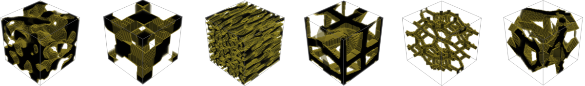
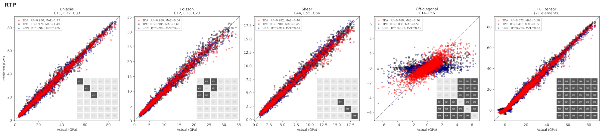

# Direction-aware topological descriptors for elastic stiffness tensor prediction in porous materials


This repository contains the code for the paper:

*Direction-aware topological descriptors for elastic stiffness tensor prediction in porous materials*

by: Rafał Topolnicki,  Michał Bogdan, Jakub Malinowski, Bartosz Naskręcki, Maciej Harańczyk, Paweł Dłotko



## Requirements

### Julia (for directional ECP computation)
Computing the directional Euler Characteristic Profile (ECP) descriptors requires [Julia](https://julialang.org/downloads/) (developed with Julia 1.6+). Project dependencies are pinned in `Project.toml`/`Manifest.toml`. After cloning the repository, install them with:
```
julia --project="./" -e "using Pkg; Pkg.instantiate()"
```
This resolves and installs the `Ecp` package ([Malinon/ECP_toolkit](https://github.com/Malinon/ECP_toolkit)) and its dependencies into a local, isolated environment — no global Julia packages are modified.

## Reproduce results
The instructions below describe how to reproduce all results reported in the paper. 

**Note:**  
You **do not need** to run elastic simulations or recompute TDA descriptors to reproduce the manuscript results.  
The full dataset is provided, including:
- voxelized structures,  
- elastic tensor values,  
- vectorized topological descriptors

### Structures
Structures are provided as vectorized 3D binary volumes of shape 
80x80x80, saved in NumPy’s native `.npy` format. The dataset contains total of 5251 porous structures (500 for RTP, 2376 for TD and 2375 for ATTD datasets) 
located in the `structures/` directory, with a total size of approximately 2.6GB. 
Because these files are tracked with Git LFS, make sure Git LFS is installed before downloading the data. After cloning the repository, run:
```
git lfs install
git lfs pull
```
This will fetch the full `.npy` volumes into `structures/`.

### Structures visualization
In `scripts/npy_to_vtk.py` we provide a script to transform structures written in npy format to VTK format that can be visualized using e.g. ParaView software. 

### Computing the elastic stiffness tensor
The full 6x6 effective stiffness tensor (Voigt notation) is computed directly from the voxelized `.npy` structures using an FFT-based homogenization solver, `scripts/compute_stiffness_tensor.py` (see the paper, Section 2, "Estimation of the elastic stiffness tensor"). To compute it for all three datasets (RTP, TD, ATTD), run:
```
bash run_stiffness.sh
```
This writes `structures/stiffness_rtp.csv`, `structures/stiffness_td.csv`, and `structures/stiffness_attd.csv`. 
Comment the datasets you do want to compute.
Adjust `--workers` inside the script to match the number of cores on your machine.

## Descriptors
### Directional topological descriptors
Direction-aware ECP and PH descriptors are computed from the voxelized structures for each of 7 loading directions (3 coordinate axes, 3 face diagonals, 1 body diagonal), using the cone+PCA filtration described in the paper. This step requires the `structures/stiffness_*.csv` file from the previous step (used to attach stiffness-tensor labels) and a working Julia environment (see Requirements above). Run:
```
bash run_directional_tda_desc.sh
```
For each direction this (1) computes the filtration (`scripts/directional_multifiltration.py`), (2) computes the ECP at grid resolution 8 (`scripts/directional_ecp.jl`), (3) computes PH at persistence-image resolution 12x12 (`scripts/ph_calc.py`), then collects all directions into direction-tagged CSV databases:
```
database/directional.tda.radius=3.coneheight=6.coneradius=3/<dataset>/ecp_gridres=8/database_ecp.csv
database/directional.tda.radius=3.coneheight=6.coneradius=3/<dataset>/ph_res=12x12/database_ph_cone.csv
```
By default only the RTP dataset is enabled; uncomment the TD/ATTD calls at the bottom of the script to compute those too.

### Baseline methods
Three non-topological descriptors are used as baselines compared against TDA: a porosity profile, a two-point correlation function (TPC), and a fabric tensor profile.

**Non-directional** (single profile per structure), using the ready-to-use databases described below:
```
bash run_baseline_descriptors.sh
```
Reads `database/directional/{rtp,td,attd}/database_both.csv` and writes to `database/baseline.{porosity,tpc,fabric}/<dataset>/database.csv`.

**Directional** (profile computed along each of the 7 loading directions — the baselines actually compared against direction-aware TDA in the paper). Requires `structures/stiffness_*.csv` from the stiffness-tensor step:
```
bash run_directional_baseline_descriptors.sh
```
Writes to:
```
database/baseline.porosity.profiles/<dataset>/database.csv
database/baseline.tpc.directional/<dataset>/database.csv
database/baseline.fabric.directional/<dataset>/database.csv
```

### Databases
Ready-to-use directional TDA databases (ECP and PH, computed as described above) are provided for all three datasets:
* `database/directional.tda.radius=3.coneheight=6.coneradius=3/rtp/ecp_gridres=8/database_ecp.csv`
* `database/directional.tda.radius=3.coneheight=6.coneradius=3/rtp/ph_res=12x12/database_ph_cone.csv`
* `database/directional.tda.radius=3.coneheight=6.coneradius=3/td/ecp_gridres=8/database_ecp.csv`
* `database/directional.tda.radius=3.coneheight=6.coneradius=3/td/ph_res=12x12/database_ph_cone.csv`
* `database/directional.tda.radius=3.coneheight=6.coneradius=3/attd/ecp_gridres=8/database_ecp.csv`
* `database/directional.tda.radius=3.coneheight=6.coneradius=3/attd/ph_res=12x12/database_ph_cone.csv`

Use these files to train the models :smiley:

### Fitting model using the CatBoost

Both training scripts below use `scripts/train_catboost_directional.py`, and write to the `results/` directory. By default each runs on RTP only; edit the `for DATASET in rtp; do` line inside the script to also include `td`/`attd`.

To train on the direction-aware TDA descriptors (ECP + PH + porosity), run:
```
bash run_catboost_tda.sh
```

To train on the non-topological baselines (TPC, porosity profile, fabric), run:
```
bash run_catboost_baselines.sh
```

### Fitting model using the Neural Networks
To train the CNN baseline (DenseNet-121, trained directly on the voxelized structures) from `scripts/train_nn.py`, run:
```
bash run_nn_directional.sh
```
By default this runs all target-group combinations on RTP (the five reported in the paper, plus two cumulative subsets); edit the script to uncomment the ATTD/TD blocks for the other datasets. Requires `structures/stiffness_*.csv` from the stiffness-tensor step. Results are saved to `results/cnn/<dataset>/`.

## Acknowledgments
Financial support from the PORMETALOMICS project, funded by the Spanish
Ministry for Science, Innovation, and Universities (award no.
PCI2022-132975) and the National Science Centre, Poland (project no.
2021/03/Y/ST5/00232) within the M-ERA.NET 3 call, is gratefully acknowledged. 
This project has received funding from the European Union’s Horizon 2020 research and innovation programme under grant agreement No 958174.

This research is financed under Dioscuri, a programme initiated by the
Max Planck Society, jointly managed with the National Science Centre
in Poland, and mutually funded by Polish Ministry of Science and
Higher Education and German Federal Ministry of Research,
Technology and Space.

The calculations were made with the support of the Interdisciplinary Center for Mathematical and Computational Modeling of the University of Warsaw (ICM UW) under the computational grant no g105-2705.

## Credits
Some CNN implementations used in this repo modifies the code from [xmuyzz/3D-CNN-PyTorch](https://github.com/xmuyzz/3D-CNN-PyTorch) repository.

